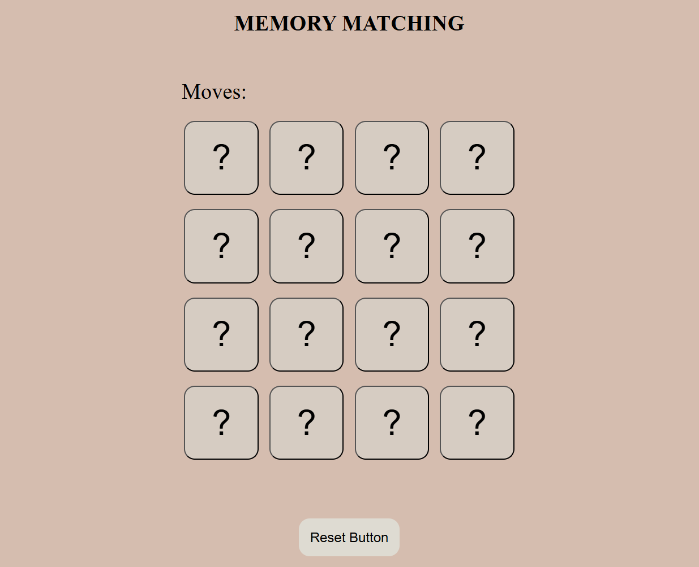

# 🧠 Memory Matching Game

An engaging and interactive memory game developed for the browser using **HTML**, **CSS**, and **JavaScript**.

---

## 🚀 Features

- Flip-to-reveal card animation  
- Match detection with visual feedback  
- Score or attempt counter *(if implemented)*  
- Game reset/restart functionality  
- Fully responsive for mobile and desktop devices

---

## 🎮 How to Play

1. **Start the Game**  
   All cards are placed face down.

2. **Flip Two Cards**  
   Click on any two cards to flip them and reveal the images.

3. **Check for a Match**  
   - If the cards match, they stay face up.  
   - If not, they flip back after a short delay.

4. **Repeat**  
   Keep flipping and matching cards until all pairs are found.

5. **Restart Anytime**  
   Click the "Restart" button (if available) to reshuffle and start over.

---

### 🔗 [CLICK HERE TO OPEN](https://vidushi-coder.github.io/Memory-Game/index.html)

### 📸 Project Preview

---

  

